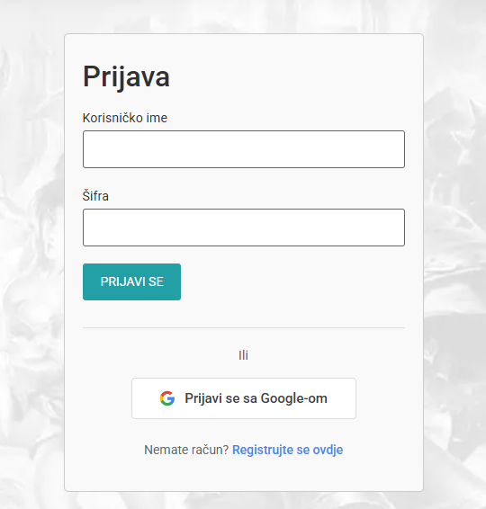
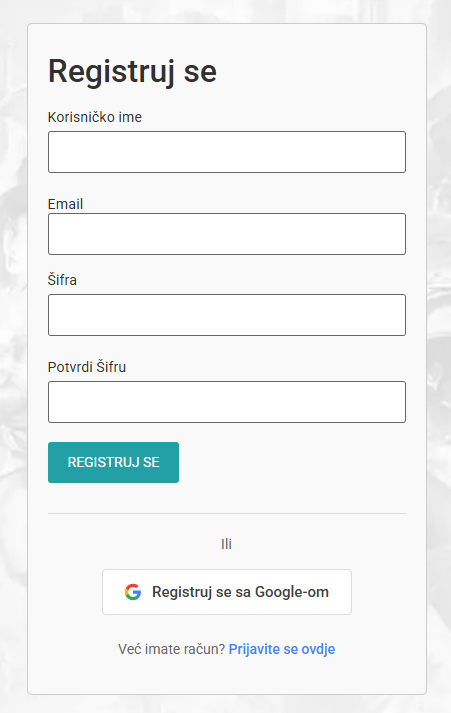

# WordPress Custom Auth Login (Reference Implementation)

## Overview

This repository contains a **reference WordPress plugin** demonstrating how to implement a **custom login and registration UI with Google OAuth**, while **preserving WordPress’ native authentication engine**.

It is **not a production-ready plugin**, but an **architectural reference** intended for:
- Portfolio demonstration
- Learning advanced WordPress auth patterns
- Preparing WordPress for headless or mobile (JWT) authentication

---

## Why This Exists

Many tutorials and plugins:
- Block or rename `wp-login.php`
- Break logout and password reset flows
- Replace WordPress session handling

This project demonstrates the correct pattern:

> **Redirect the login interface, not the login process.**

WordPress remains the source of truth for users, sessions, cookies, and permissions.

---

## What This Plugin Does

- Works with custom `/login` and `/register` pages
- Integrates Google OAuth (identity provider only)
- Supports standard username/password login
- Redirects users away from the default `wp-login.php` UI
- Preserves all WordPress core auth flows (login, logout, reset, admin)

---

## What This Plugin Intentionally Does NOT Do

- Rename or disable `wp-login.php`
- Replace WordPress session or cookie handling
- Store OAuth access tokens
- Implement MFA, CAPTCHA, or rate limiting
- Provide UI styling or branding

These are **deliberate non-goals**.

---

## How It’s Implemented (High Level)

- `/login` and `/register` are **standard WordPress pages**
- Each page uses a **custom page template** provided by the plugin
- Forms submit to **WordPress’ native auth endpoints**
- Google OAuth is used only to identify the user
- Authentication cookies and sessions are handled by WordPress core

The default login UI is hidden by redirecting **only the visual login form** using the `login_form_login` hook — without interfering with internal auth logic.

---

## Key Technical Decisions

- Redirects only the login UI, not authentication
- Uses `login_form_login` instead of `login_init`
- Avoids login-state checks inside auth hooks
- Separates UI, auth engine, and OAuth responsibilities

---

## File Structure

```
google-login.php        # Core plugin logic
login-page.php          # Custom login page template
register-page.php       # Custom registration page template
assets/css/auth.css     # Minimal scoped styling (optional)
docs/screenshots/       # UI screenshots
README.md
```

---

## Screenshots

### Custom Login Page


### Registration Page


---

## Intended Audience

- WordPress developers implementing custom auth
- Developers building headless or mobile clients on top of WordPress
- Recruiters reviewing backend and architecture skills

---

## Security Notes

- HTTPS is required
- Google credentials must be stored securely
- Additional hardening depends on project context

---

## Disclaimer

This code is provided **for educational and reference purposes only**.  
Security requirements vary by project and environment.

---

### Author
**BalkanGameHub**  
Senior WordPress / Backend Architecture Reference
